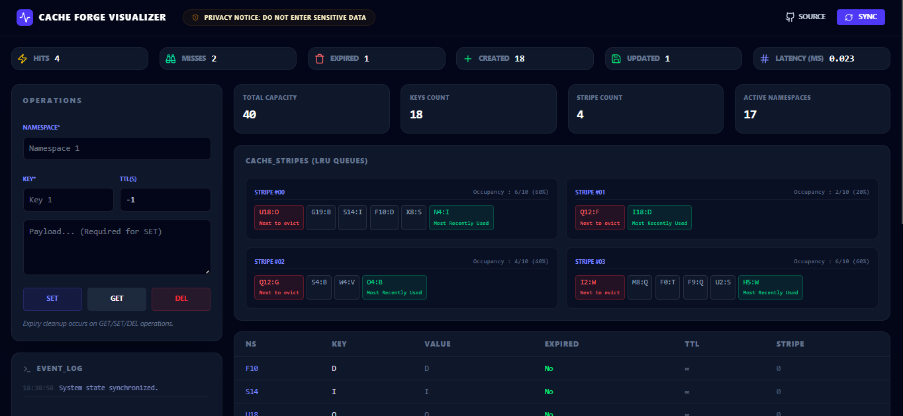
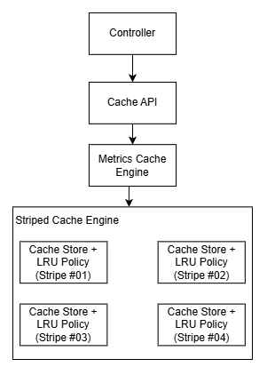

# Cache Forge [](https://github.com/saoodahmad/cache-forge/actions/workflows/ci.yml)

<p align="center">
    
</p>

**A high-concurrency in-memory cache engine with TTL, LRU eviction, striped locking, and observability**

## Features

- Striped cache engine for scalable concurrency
- Per-stripe LRU queues
- Namespace-aware key model
- Stripe-level state introspection
- Key–value storage
- TTL-based expiration
- LRU eviction (access-order)
- Deterministic time via `TimeProvider`
- Clean domain model (`CacheResult`)
- Pluggable storage (`CacheStore`)
- Metrics via Micrometer + Spring Boot Actuator

## Architecture

<p align="center">
    
</p>

- **Cache API** converts domain results into API responses
- **Metrics Cache Engine** adds observability without polluting core logic
- **Striped Cache Engine** implements TTL, eviction, and consistency
- **Cache Store** stores cache entries
- **LRU Policy** tracks recency and evictions

## Striped Cache Model (Single-Node Concurrency Scaling)

- Cache is divided into **N fixed equal capacity stripes**
- Each stripe has:
  - Its own `CacheStore`
  - Its own `LRUPolicy`
  - Its own lock
- Keys are routed using:

```java
stripeIndex = hash(fullKey) % stripeCount #fullKey = namespace + key
```

### Properties

Application properties can be configured via `application.properties` file

```
cacheforge.stripes = 4;
cacheforge.capacity = 40; #total cache capacity
```

## TTL & Expiry

TTL is evaluated using an injected `TimeProvider`  
(system time in production, controllable clock in tests).

Expired keys are cleaned up eagerly on:

- `GET`
- `SET`
- `DEL`

## Domain Result Model

Internally, operations return:

- `Hit(entry)`
- `Created(entry)`
- `Updated(entry)`
- `Miss`
- `Expired`

The REST API exposes this as:

```
{ operation, hit, miss, data }
```

## Observability

Cache Forge exposes metrics via Actuator:

### Counters

- `cacheforge.cache.calls` (tagged by `op=get|set|del`)
- `cacheforge.cache.hits` (tagged by `op=get|del`)
- `cacheforge.cache.misses` (tagged by `op=get|del`)
- `cacheforge.cache.expired` (tagged by `op=get|del`)
- `cacheforge.cache.set.created`
- `cacheforge.cache.set.updated`

### Gauges

- `cacheforge.cache.latency.last` (tagged by `op=get|set|del`)

### Timer

- `cacheforge.cache.latency` (tagged by `op=get|set|del`)

## Local Setup

### Pre-requisite

- Java 21+
- Maven 3.9.6
- Node 20+

### Verify Installtion

```bash
java -version
mvn -v
```

### Run

```bash
# cache
./mvnw clean package
java -jar target/cacheforge-0.0.1-SNAPSHOT.jar

# visualizer
cd frontend
npm run build
npm run preview
```

Open <a href="http://localhost:3000">localhost:3000</a> in your preferred browser to open visualizer and interact with cache.

The cache is available as an api at <a href="http://localhost:5000/api/cache">localhost:5000/api/cache</a>

**SET KEY API:**

```
POST: /api/cache/set
body = {namespace: string, key: string, message: string, ttl: integer}
```

**GET KEY API:**

```
GET: /api/cache/get/{namespace}/{key}
```

**DEL KEY API:**

```
DEL: /api/cache/del/{namespace}/{key}
```

**STATE API:**

```
GET: /api/cache/state
```

## How to query Metrics

Some metrics like Hit, Miss, Expired, Created, Updated and latency is visible on visualizer. Metrics can also be queried from cache directly through actuator metrics API.

```bash
# Get all available metrics to query
GET /actuator/metrics

# Metrics listed  above in metrics route can be queried in below ways
GET /actuator/metrics/cacheforge.cache.hits?tag=op:get
GET /actuator/metrics/cacheforge.cache.latency
GET /actuator/metrics/cacheforge.cache.calls
```
